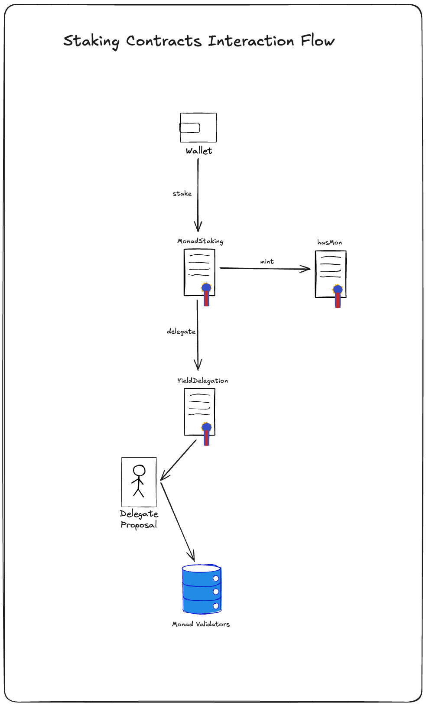
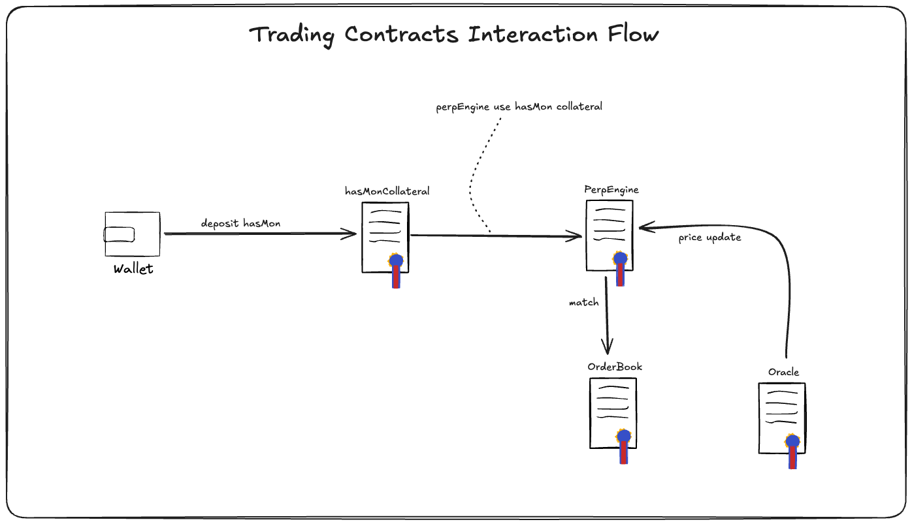
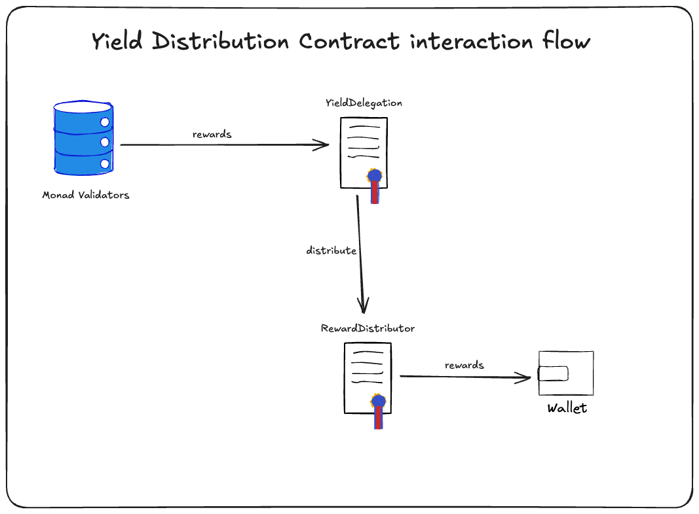

# Parallel Perps: System Architecture Document


## System Overview

Parallel Perps is a decentralized perpetual futures trading platform built on Monad. The system leverages MON token staking to create a derivative token (hasMON) that serves as collateral for trading, while simultaneously generating yield for users through delegation mechanisms.

The core innovation is a parallelized order book system that enables high-throughput trading with minimal latency, combined with a capital-efficient collateral system that puts users' staked assets to work.

## Frontend Architecture

### Tech Stack

- **Framework**: Next.js with TypeScript
- **State Management**: Redux Toolkit for global state, React Query for data fetching
- **Styling**: Tailwind CSS with shadcn/ui components
- **Wallet Integration**: RainbowKit + wagmi
- **Charts**: TradingView Lightweight Charts
- **Data Visualization**: D3.js for custom analytics

### Frontend Modules

1. **Core Module**
    - App initialization
    - Global state management
    - Authentication (wallet connection)
    - Theme and layout
2. **Staking Module**
    - MON staking interface
    - hasMON management
    - Yield visualization
    - Staking statistics
3. **Trading Module**
    - Order book interface
    - Position management
    - Leverage adjustment
    - PnL visualization
    - Liquidation indicators
4. **Analytics Module**
    - Trading history
    - Yield performance
    - Platform metrics
    - User-specific analytics
5. **Settings Module**
    - User preferences
    - Risk management settings
    - Notification configurations

### Responsive Design Strategy

- Mobile-first approach with adaptive layouts
- Critical functions accessible on all devices
- Complex trading features optimized for desktop
- Simplified mobile experience for monitoring positions

## User Journey

### 1. Onboarding Flow

1. Connect wallet
2. Overview tutorial (skippable)
3. MON token approval request
4. Initial staking flow introduction

### 2. Staking Journey

1. MON balance displayed
2. Select staking amount
3. Review potential yield projections
4. Approve staking transaction
5. Receive hasMON tokens
6. View staking position dashboard

### 3. Trading Journey

1. Navigate to trading interface
2. Select trading pair (e.g., BTC/USD)
3. Choose amount of hasMON to use as margin
4. Approve hasMON collateral deposit
5. Set leverage and position size
6. Place order (market or limit)
7. Monitor position in real-time
8. Close position or adjust parameters

### 4. Yield Collection Journey

1. Navigate to rewards dashboard
2. View accumulated yield
3. Claim rewards (auto-compounds by default)
4. View yield history and analytics

### 5. Unstaking Journey

1. Navigate to staking dashboard
2. Select hasMON amount to unstake
3. Review unstaking details and timeframes
4. Confirm unstaking transaction
5. Receive original MON tokens after unstaking period

## Smart Contract Architecture

### Core Contracts

1. **MonadStaking**
    - **Purpose**: Manages MON token staking and hasMON minting
    - **Key Functions**:
        - `stake(uint256 amount)`: Stakes MON tokens and mints hasMON
        - `unstake(uint256 amount)`: Burns hasMON and returns MON (with timelock)
        - `getStakedBalance(address user)`: Returns user's staked MON
    - **Events**:
        - `Staked(address user, uint256 amount)`
        - `Unstaked(address user, uint256 amount)`
2. **HasMon (ERC-20)**
    - **Purpose**: Staking derivative token representing staked MON
    - **Key Functions**:
        - Standard ERC-20 functions
        - `mint(address to, uint256 amount)`: Only callable by MonadStaking
        - `burn(address from, uint256 amount)`: Only callable by MonadStaking
3. **YieldDelegation**
    - **Purpose**: Delegates MON tokens to external validators for yield
    - **Key Functions**:
        - `delegate(address validator, uint256 amount)`: Delegates MON to validators
        - `undelegate(address validator, uint256 amount)`: Undelegates MON
        - `harvestRewards()`: Collects rewards from validators
    - **Events**:
        - `Delegated(address validator, uint256 amount)`
        - `RewardsHarvested(uint256 amount)`
4. **RewardDistributor**
    - **Purpose**: Distributes yield rewards to hasMON holders
    - **Key Functions**:
        - `distributeRewards(uint256 amount)`: Distributes rewards to hasMON holders
        - `claimRewards(address user)`: Allows user to claim their rewards
        - `getUnclaimedRewards(address user)`: Returns unclaimed rewards
    - **Events**:
        - `RewardsDistributed(uint256 amount)`
        - `RewardsClaimed(address user, uint256 amount)`
5. **hasMONCollateral**
    - **Purpose**: Manages hasMON as collateral for trading
    - **Key Functions**:
        - `deposit(uint256 amount)`: Deposits hasMON as collateral
        - `withdraw(uint256 amount)`: Withdraws hasMON from collateral
        - `getCollateralBalance(address user)`: Returns user's collateral balance
    - **Events**:
        - `CollateralDeposited(address user, uint256 amount)`
        - `CollateralWithdrawn(address user, uint256 amount)`
6. **PerpEngine**
    - **Purpose**: Core perpetual trading logic
    - **Key Functions**:
        - `openPosition(bytes32 marketId, bool isLong, uint256 size, uint256 leverage)`: Opens a trading position
        - `closePosition(bytes32 positionId)`: Closes a position
        - `liquidatePosition(bytes32 positionId)`: Liquidates undercollateralized positions
        - `updateFundingRate(bytes32 marketId)`: Updates funding rates
    - **Events**:
        - `PositionOpened(bytes32 positionId, address user, bytes32 marketId, bool isLong, uint256 size, uint256 leverage)`
        - `PositionClosed(bytes32 positionId, int256 pnl)`
        - `PositionLiquidated(bytes32 positionId, address user)`
7. **OrderBook**
    - **Purpose**: Maintains and matches orders for trading
    - **Key Functions**:
        - `placeOrder(bytes32 marketId, bool isBuy, uint256 price, uint256 amount)`: Places a limit order
        - `cancelOrder(bytes32 orderId)`: Cancels an existing order
        - `matchOrders()`: Matches compatible orders
    - **Events**:
        - `OrderPlaced(bytes32 orderId, address user, bytes32 marketId, bool isBuy, uint256 price, uint256 amount)`
        - `OrderMatched(bytes32 buyOrderId, bytes32 sellOrderId, uint256 price, uint256 amount)`
        - `OrderCancelled(bytes32 orderId)`

### Contract Inheritance Structure

```
ERC20
  └── HasMon

Ownable
  ├── MonadStaking
  ├── YieldDelegation
  ├── RewardDistributor
  ├── hasMONCollateral
  ├── PerpEngine
  └── OrderBook

ReentrancyGuard
  ├── MonadStaking
  ├── hasMONCollateral
  ├── PerpEngine
  └── OrderBook

Pausable
  ├── MonadStaking
  ├── PerpEngine
  └── OrderBook

```

### Smart Contract Interactions

1. **Staking Flow**:
    
    ```
    User -> MonadStaking -> HasMon -> YieldDelegation
    
    ```
    
2. **Yield Distribution Flow**:
    
    ```
    YieldDelegation -> RewardDistributor -> User
    
    ```
    
3. **Trading Flow**:
    
    ```
    User -> hasMONCollateral -> PerpEngine <-> OrderBook
    
    ```
    
4. **Liquidation Flow**:
    
    ```
    Oracle -> PerpEngine -> hasMONCollateral -> User
    
    ```
    

## Data Flow Diagrams

### Staking Flow



### Trading Flow



### Yield Distribution Flow



## External Integrations

### 1. Oracle Services

- **Provider**: Pyth Network
- **Purpose**: Real-time price feeds for trading pairs
- **Integration Method**: On-chain oracle contracts
- **Data Flow**:
    - Pyth publishes price updates to on-chain oracle
    - PerpEngine subscribes to oracle updates
    - Price updates trigger mark price adjustments and potential liquidations

### 2. Validator Integration

- **Provider**: Monad Validators
- **Purpose**: Delegate staked MON for yield generation
- **Integration Method**: Validator staking contracts
- **Data Flow**:
    - YieldDelegation contract delegates MON to validators
    - Validators provide staking rewards
    - YieldDelegation harvests rewards periodically

### 3. RPC Node Providers

- **Provider**: Ankr, Infura, or dedicated Monad nodes
- **Purpose**: Connect frontend to blockchain
- **Integration Method**: JSON-RPC API
- **Data Flow**:
    - Frontend connects to RPC nodes
    - User transactions are submitted via RPC
    - Blockchain state is queried via RPC

### 4. Indexing Service

- **Provider**: The Graph or custom indexer
- **Purpose**: Efficient querying of historical data
- **Integration Method**: GraphQL API
- **Data Flow**:
    - Smart contract events are indexed
    - Frontend queries indexed data for analytics and history
    - Reduces on-chain read operations for better performance

### 5. Analytics Integration

- **Provider**: Custom analytics engine
- **Purpose**: Advanced trading metrics and platform analytics
- **Integration Method**: REST API
- **Data Flow**:
    - Trading data is processed by analytics engine
    - Frontend displays processed metrics
    - Users access personalized analytics

## Deployment Strategy

### Initial Deployment

1. Deploy core contracts (HasMON, MonadStaking)
2. Deploy yield management contracts (YieldDelegation, RewardDistributor)
3. Deploy trading contracts (hasMONCollateral, PerpEngine, OrderBook)
4. Configure contract interconnections
5. Deploy frontend to decentralized storage (IPFS)
6. Configure domain and CDN

### Upgradability Strategy

- Implement transparent proxy pattern for key contracts
- Use multisig for governance and emergency actions
- Establish timelocks for critical upgrades

### Phased Rollout

1. **Phase 1**: Staking and hasMON minting
2. **Phase 2**: Yield delegation and distribution
3. **Phase 3**: Simple perpetual trading
4. **Phase 4**: Advanced trading features and full orderbook

## Security Considerations

### Smart Contract Security

- Multiple independent audits
- Formal verification of critical components
- Comprehensive test coverage (unit, integration, fuzz)
- Bug bounty program

### Risk Management

- Tiered liquidation system
- Insurance fund for socialized losses
- Circuit breakers for extreme volatility
- Position size limits based on market liquidity

### User Security

- Hardware wallet integration
- Multi-signature support for large positions
- Transaction confirmation screens
- Real-time risk indicators

### Compliance Measures

- Geofencing based on regulatory requirements
- KYC integration option for institutional users
- Transparent fee structure and reporting
- Privacy-preserving analytics

# Parallel Perps: System Architecture Document

## Table of Contents

1. System Overview
2. Frontend Architecture
3. User Journey
4. Smart Contract Architecture
5. Data Flow Diagrams
6. External Integrations
7. Deployment Strategy
8. Security Considerations

## System Overview

Parallel Perps is a decentralized perpetual futures trading platform built on Monad. The system leverages MON token staking to create a derivative token (hasMON) that serves as collateral for trading while simultaneously generating yield for users through delegation mechanisms.

The core innovation is a parallelized order book system that enables high-throughput trading with minimal latency, combined with a capital-efficient collateral system that puts users' staked assets to work.

## Frontend Architecture

### Tech Stack

- **Framework**: Next.js with TypeScript
- **State Management**: Redux Toolkit for global state, React Query for data fetching
- **Styling**: Tailwind CSS with shadcn/ui components
- **Wallet Integration**: RainbowKit + wagmi
- **Charts**: TradingView Lightweight Charts
- **Data Visualization**: D3.js for custom analytics

### Frontend Modules

1. **Core Module**
    - App initialization
    - Global state management
    - Authentication (wallet connection)
    - Theme and layout
2. **Staking Module**
    - MON staking interface
    - hasMON management
    - Yield visualization
    - Staking statistics
3. **Trading Module**
    - Order book interface
    - Position management
    - Leverage adjustment
    - PnL visualization
    - Liquidation indicators
4. **Analytics Module**
    - Trading history
    - Yield performance
    - Platform metrics
    - User-specific analytics
5. **Settings Module**
    - User preferences
    - Risk management settings
    - Notification configurations

### Responsive Design Strategy

- Mobile-first approach with adaptive layouts
- Critical functions accessible on all devices
- Complex trading features optimized for desktop
- Simplified mobile experience for monitoring positions

## User Journey

### 1. Onboarding Flow

1. Connect wallet
2. Overview tutorial (skippable)
3. MON token approval request
4. Initial staking flow introduction

### 2. Staking Journey

1. MON balance displayed
2. Select staking amount
3. Review potential yield projections
4. Approve staking transaction
5. Receive hasMON tokens
6. View staking position dashboard

### 3. Trading Journey

1. Navigate to trading interface
2. Select trading pair (e.g., BTC/USD)
3. Choose amount of MON or hasMON to use as margin
4. Approve collateral deposit
5. Set leverage and position size
6. Place order (market or limit)
7. Monitor position in real-time
8. Close position or adjust parameters

### 4. Yield Collection Journey

1. Navigate to rewards dashboard
2. View accumulated yield
3. Claim rewards (auto-compounds by default)
4. View yield history and analytics

### 5. Unstaking Journey

1. Navigate to staking dashboard
2. Select hasMON amount to unstake
3. Review unstaking details and timeframes
4. Confirm unstaking transaction
5. Receive original MON tokens after unstaking period

## Smart Contract Architecture

### Core Contracts

1. **MonadStaking**
    - **Purpose**: Manages MON token staking and hasMON minting
    - **Key Functions**:
        - `stake(uint256 amount)`: Stakes MON tokens and mints hasMON
        - `unstake(uint256 amount)`: Burns hasMON and returns MON (with timelock)
        - `getStakedBalance(address user)`: Returns user's staked MON
    - **Events**:
        - `Staked(address user, uint256 amount)`
        - `Unstaked(address user, uint256 amount)`
2. **HasMon (ERC-20)**
    - **Purpose**: Staking derivative token representing staked MON
    - **Key Functions**:
        - Standard ERC-20 functions
        - `mint(address to, uint256 amount)`: Only callable by MonadStaking
        - `burn(address from, uint256 amount)`: Only callable by MonadStaking
3. **YieldDelegation**
    - **Purpose**: Delegates MON tokens to external validators for yield
    - **Key Functions**:
        - `delegate(address validator, uint256 amount)`: Delegates MON to validators
        - `undelegate(address validator, uint256 amount)`: Undelegates MON
        - `harvestRewards()`: Collects rewards from validators
4. **RewardDistributor**
    - **Purpose**: Distributes yield rewards to hasMON holders
5. **CollateralManager**
    - **Purpose**: Manages MON and hasMON as collateral for trading
6. **PerpEngine**
    - **Purpose**: Core perpetual trading logic
7. **OrderBook**
    - **Purpose**: Maintains and matches orders for trading